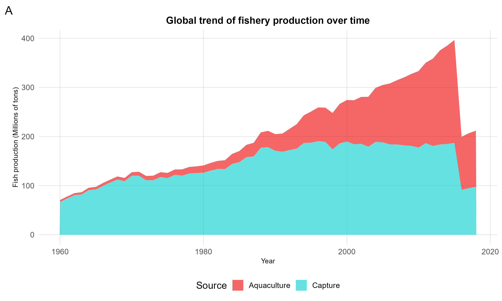
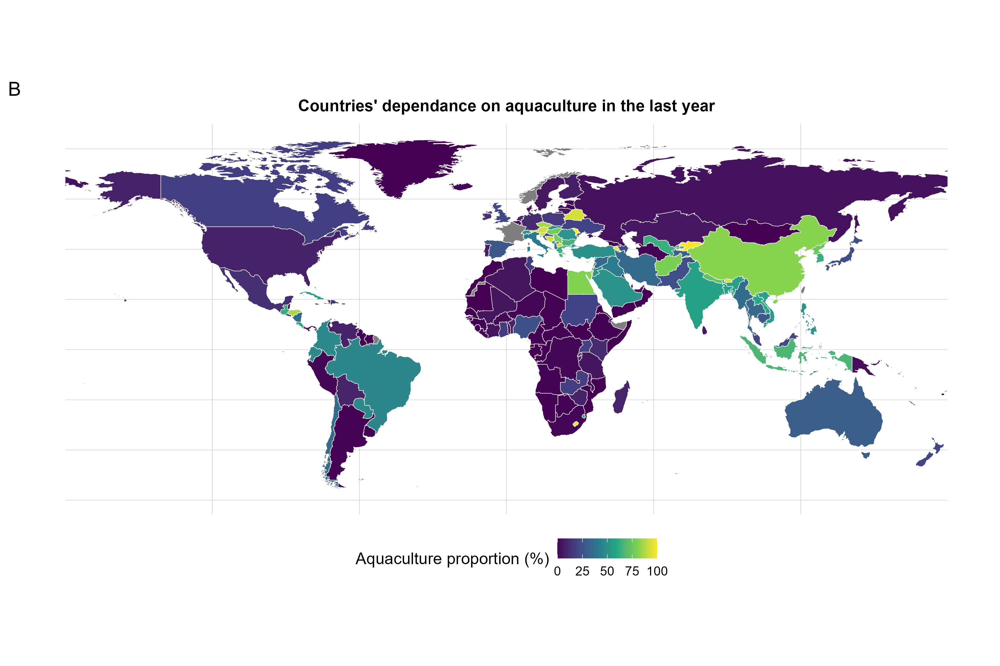

# Global Seafood Production Analysis: Capture Fisheries vs. Aquaculture

# Overview
As the global demand for seafood rises, understanding the ecological shift from traditional capture fisheries to aquaculture (fish farming) is crucial for marine conservation and sustainable resource management. 

This repository contains an end-to-end data analysis project written in R, exploring the temporal dynamics and spatial distribution of global seafood production. The aim is to quantify how much the world relies on aquaculture today and how this dependence has evolved over the last 60 years.

# Data Source
The data used in this project was provided by the [TidyTuesday project (2021-10-12)](https://github.com/rfordatascience/tidytuesday) and originally sourced from *Our World in Data*. 

# Methodology
The entire data wrangling, geostatistical processing, and visualization pipeline was developed in R. 
Key packages used:
* `tidyverse` (`dplyr`, `tidyr`, `ggplot2`), `patchwork`, `viridis`, sf` & `rnaturalearth`. 

# Key Findings & Visualizations

## 1. Global Trend Over Time (1960 - Present)
*Description: An area chart tracking the total global production (in millions of tons) of both sources.*

Finding: The data clearly illustrates the stagnation of capture fisheries starting in the late 1980s/early 1990s, likely due to maximum sustainable yields being reached or overfishing. The subsequent gap in global demand has been entirely filled by the exponential growth of aquaculture.

## 2. National Dependence on Aquaculture (Latest Year)
*Description: A global choropleth map representing the proportion (%) of total seafood production derived from aquaculture for each country.*

Finding: The spatial analysis reveals significant geographical disparity. While some inland or densely populated Asian nations exhibit an extreme dependence on aquaculture (>80%), many coastal and oceanic nations still rely almost exclusively on traditional capture fisheries. 

# Repository Structure
* `/scripts` - Contains the `main_analysis.R` script with the full pipeline.
* `/outputs` - High-resolution plots (`.png`) generated by the script.
* `/data` - (If applicable) Raw `.csv` datasets.

# Author
**Massimo Fruscoloni** 
